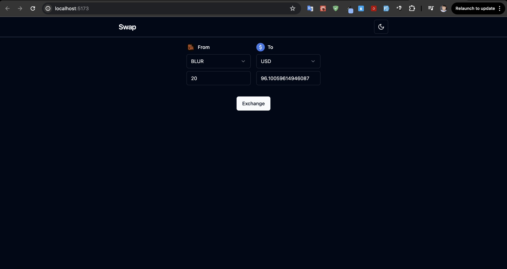

## Pre-requisites
- Install [Node.js](https://nodejs.org/en/download/)
- Install [Yarn](https://yarnpkg.com/getting-started/install)

## Setup
1. Install dependencies in the `root` directory
    ```bash
    yarn install
    ```
2. Start the server in the `problem2` directory
    ```bash
    yarn dev
    ```
3. Open the browser and go to the following URL
    ```bash
    http://localhost:5173/
    ```
4. Test application



## Features
1. Exchange values between two currencies
2. Dark mode and light mode
3. Beautiful UI with `shadcn` library