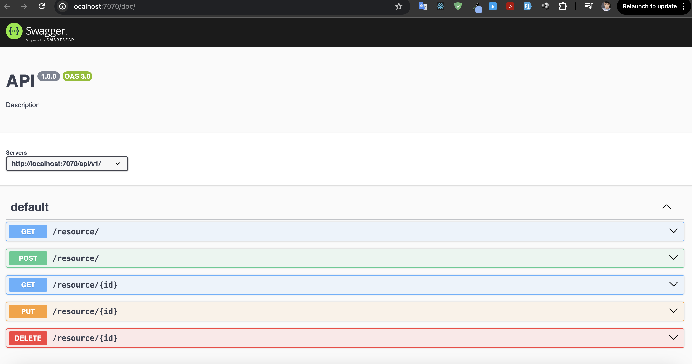

## Pre-requisites
- Install [Node.js](https://nodejs.org/en/download/)
- Install [Yarn](https://yarnpkg.com/getting-started/install)

## Setup
1. Install dependencies in the `root` directory
    ```bash
    yarn install
    ```
2. Create environment variables in the `.env` file in the `problem5` directory
    ```bash
    DATABASE_URL="postgres://postgres.phwaityfsdbevbxcdqpq:minhthao56@@aws-0-ap-southeast-1.pooler.supabase.com:6543/postgres"
    ```
3. Run the server in the `problem5` directory
    ```bash
    yarn start
    ```
4. Open the browser and go to swagger documentation
    ```bash
    http://localhost:7070/doc
    ```
5. Test the API in the swagger documentation



## Code Structure
- `src` directory contains the source code of the application
- `src/controllers` directory contains the controllers for handling the requests
- `src/routers` directory contains the routers for routing the requests to the appropriate controller
- `drizzle` directory contains the migration files for the database
- `src/app.ts` is the entry point of the application
- `src/swagger.ts` is the swagger documentation of the application
- `src.swagger-output.json` is the output of the swagger documentation
- `drizzle.config.ts` is the configuration file for the migration
- `tsconfig.json` is the configuration file for the typescript
- `package.json` is the configuration file for the node.js application
- `.env` is the environment variables for the application
- `index.ts` is the entry point of the application

## Commands
- `yarn start` - Start the server
- `yarn build` - Build the project
- `yarn migration` - Run the migration files
- `yarn gen:migration` - Generate a new migration file
- `yarn swagger` - Generate the swagger documentation