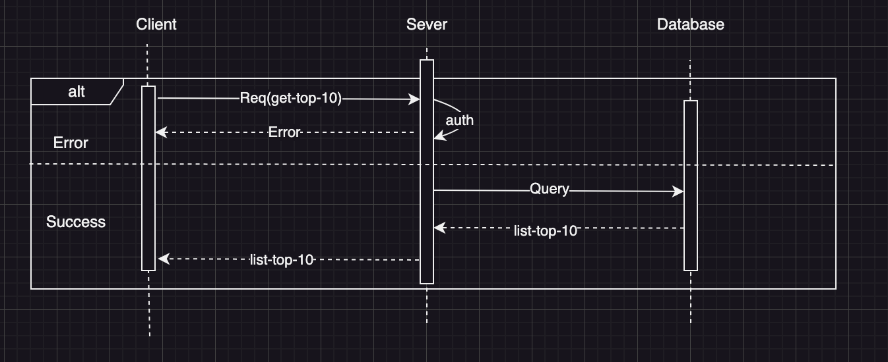
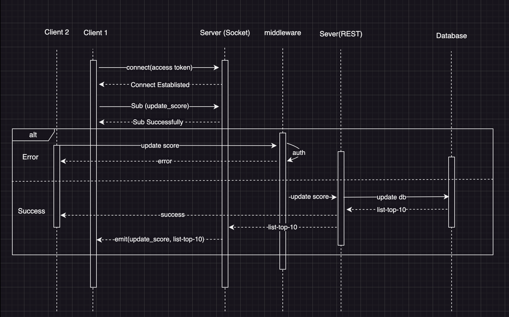

## TechStack
- Node.js - Express.js
- PostgreSQL
- RESTful API
- Socket.io

## Approaches
1. User story: As a user, I want to see the top 10 user's scores.
    - Use RESTful API to fetch the top 10 user's scores from the database.
    - Endpoint: `/api/v1/scores/top10`
    - Method: `GET`
    - Response: 
        - Code: `200`
            ```json
            {
                "status": "success",
                "data": {
                    "scores": [
                        {
                            "user_id": "1",
                            "score": 100
                        },
                        {
                            "user_id": "2",
                            "score": 90
                        },
                        ...
                    ]
                }
            }
            ```
    - Error Response:
        - Code: `500`
            ```json
            {
                "status": "error",
                "message": "An error occurred while fetching the top 10 user's scores."
            }
            ```
    - Query:
        ```sql
        SELECT user_id, score FROM scores ORDER BY score DESC LIMIT 10;
        ```
2. User story: As a user, I want to see the live update of the score board.
    - Use WebSocket to establish a connection between the client and the server.
    - Emit an event to the client whenever a new score is added.
    - Event: `update_score`
    - Data: Array of scores of the top 10 users.
        ```json
        [
            {
                "user_id": "1",
                "score": 100
            },
            {
                "user_id": "2",
                "score": 90
            },
            ...
        ]
        ```
3. User story: As a user, I want to increase my score by completing an action.
    - Use RESTful API to update the user's score in the database.
    - Endpoint: `/api/v1/scores/increase`
    - Method: `POST`
    - Request:
        ```json
        {
            "user_id": "1",
            "action": "complete"
        }
        ```
    - Response:
        - Code: `200`
            ```json
            {
                "status": "success",
                "message": "Score updated successfully."
            }
            ```
    - Error Response:
        - Code: `400`
            ```json
            {
                "status": "error",
                "message": "Invalid user_id or action."
            }
            ```
        - Code: `500`
            ```json
            {
                "status": "error",
                "message": "An error occurred while updating the score."
            }
            ```
    - Query:
        ```sql
        UPDATE scores SET score = score + 10 WHERE user_id = '1';
        ```
4. User story: As a user, I want to prevent malicious users from increasing scores without authorisation.
    - Implement authentication and authorization middleware to validate the user's identity.
    - Use JWT (JSON Web Tokens) for authentication.
    - Verify the JWT token before allowing the user to update the score.
    - Middleware:
        ```typescript
        import jwt from 'jsonwebtoken';

        const authenticate = (req, res, next) => {
            const token = req.headers.authorization;

            if (!token) {
                return res.status(401).json({
                    status: 'error',
                    message: 'Unauthorized. Please provide a valid token.'
                });
            }

            jwt.verify(token, process.env.JWT_SECRET, (err, decoded) => {
                if (err) {
                    return res.status(401).json({
                        status: 'error',
                        message: 'Unauthorized. Invalid token.'
                    });
                }

                req.user = decoded;
                next();
            });
        };
        ```
    - Usage:
        ```typescript
        import express from 'express';
        import authenticate from './middleware/authenticate';

        const app = express();

        app.post('/api/v1/scores/increase', authenticate, (req, res) => {
            // Update the user's score
        });
        ```
## Diagram
### Diagram get the top 10 user's scores


### Diagram update the user's score
